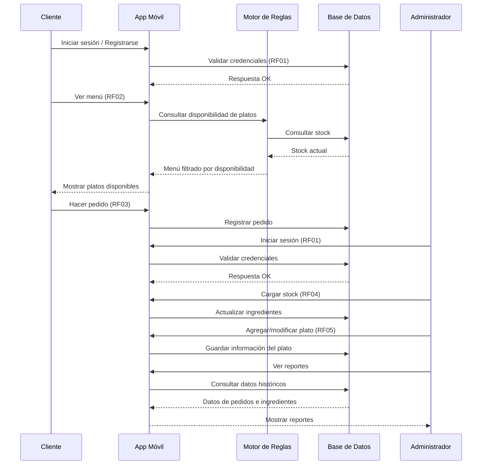

```mermaid
sequenceDiagram
    participant Cliente
    participant App Móvil
    participant Motor de Reglas
    participant Base de Datos
    participant Administrador

    %% Flujo del Cliente
    Cliente->>App Móvil: Iniciar sesión / Registrarse
    App Móvil->>Base de Datos: Validar credenciales (RF01)
    Base de Datos-->>App Móvil: Respuesta OK

    Cliente->>App Móvil: Ver menú (RF02)
    App Móvil->>Motor de Reglas: Consultar disponibilidad de platos
    Motor de Reglas->>Base de Datos: Consultar stock
    Base de Datos-->>Motor de Reglas: Stock actual
    Motor de Reglas-->>App Móvil: Menú filtrado por disponibilidad
    App Móvil-->>Cliente: Mostrar platos disponibles

    Cliente->>App Móvil: Hacer pedido (RF03)
    App Móvil->>Base de Datos: Registrar pedido

    %% Flujo del Administrador
    Administrador->>App Móvil: Iniciar sesión (RF01)
    App Móvil->>Base de Datos: Validar credenciales
    Base de Datos-->>App Móvil: Respuesta OK

    Administrador->>App Móvil: Cargar stock (RF04)
    App Móvil->>Base de Datos: Actualizar ingredientes

    Administrador->>App Móvil: Agregar/modificar plato (RF05)
    App Móvil->>Base de Datos: Guardar información del plato

    Administrador->>App Móvil: Ver reportes
    App Móvil->>Base de Datos: Consultar datos históricos
    Base de Datos-->>App Móvil: Datos de pedidos e ingredientes
    App Móvil-->>Administrador: Mostrar reportes
```